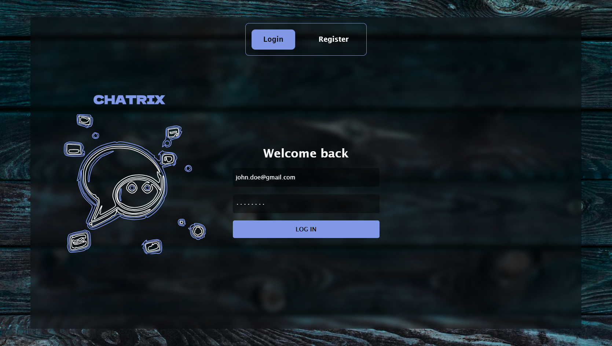
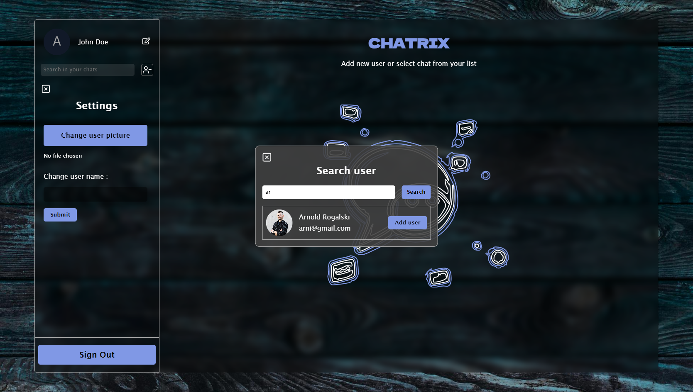
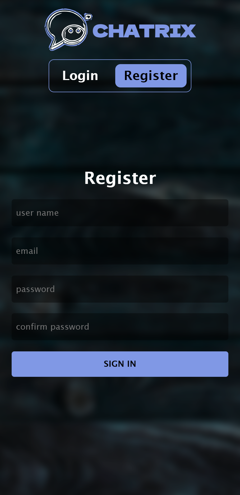
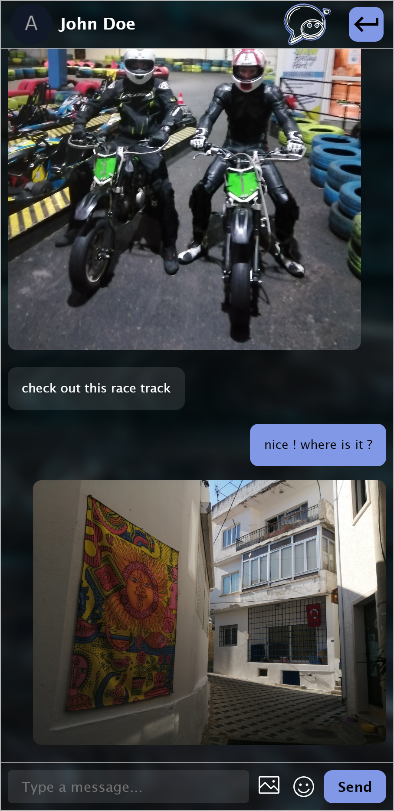

# Chatrix

-   Live Site URL: [https://kabrax01.github.io/Chatrix/](https://kabrax01.github.io/Chatrix/)

## Screenshots

## General Information

Chatrix is a real-time communication application that allows users to send text and multimedia messages in private chats. The app offers features such as registration, login, user profile management (changing name, profile picture), and searching for other users to start a conversation.

It provides a simple interface with a chat list view, enabling users to easily switch between conversations, as well as intuitive messaging and multimedia sharing.

## Built with

-   [Semantic HTML5 markup](https://developer.mozilla.org/en-US/docs/Glossary/HTML5)
-   [SCSS](https://sass-lang.com/)
-   [TypeScript](https://www.typescriptlang.org/)
-   [React](https://reactjs.org/)
-   Context API ([Redux](https://redux.js.org/) pattern)
-   [Firebase](https://firebase.google.com/)
-   [Framer Motion](https://www.framer.com/motion/)
-   [Vitest](https://vitest.dev/)
-   [React Testing Library](https://testing-library.com/)

## Author

-   Github - [Kabrax01](https://github.com/Kabrax01)
